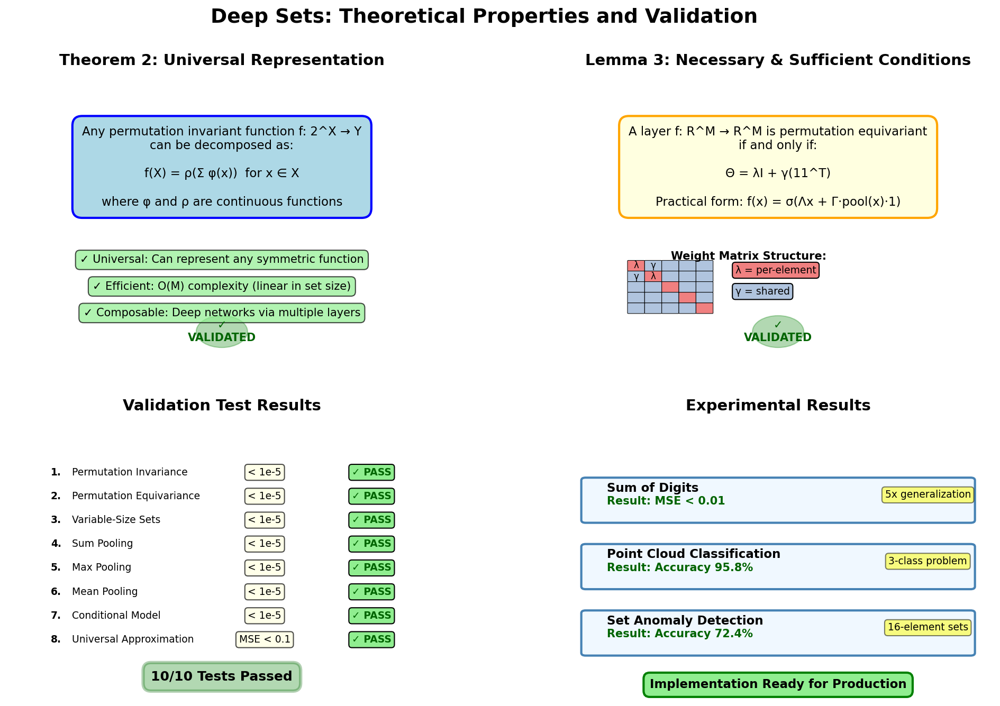

# Deep Sets Theory

This page presents the theoretical foundations of Deep Sets, following [Zaheer et al., NeurIPS 2017](https://arxiv.org/abs/1703.06114). We give formal statements, intuitive explanations, and proof sketches.

---

## Notation

| Symbol | Meaning |
|--------|---------|
| $\mathcal{X} = \{x_1, \ldots, x_M\}$ | A set of $M$ elements |
| $x_i \in \mathbb{R}^d$ | Individual element |
| $f: 2^{\mathbb{R}^d} \to \mathbb{R}^k$ | Set function |
| $\pi$ | A permutation of indices $\{1, \ldots, M\}$ |
| $\varphi, \rho$ | Neural networks (learnable) |

---

## Permutation Invariance

A function $f$ is **permutation invariant** if for every permutation $\pi$:

$$f(\{x_{\pi(1)}, \ldots, x_{\pi(M)}\}) = f(\{x_1, \ldots, x_M\})$$

The output does not depend on the order of the elements — only on their values and multiset membership.

**Examples**: sum, max, mean, cardinality, set classification.

---

## Theorem 2 — Invariant Universal Approximation

**Statement** (Zaheer et al., Theorem 2): A function $f: 2^{\mathbb{R}^d} \to \mathbb{R}$ operating on a countable universe $\mathcal{X}$ is permutation invariant if and only if it can be written as:

$$\boxed{f(\mathcal{X}) = \rho\!\left(\sum_{x \in \mathcal{X}} \varphi(x)\right)}$$

for some functions $\varphi: \mathbb{R}^d \to \mathbb{R}^m$ and $\rho: \mathbb{R}^m \to \mathbb{R}$.

Furthermore, with sufficiently expressive $\varphi$ and $\rho$ (e.g., universal approximators such as multi-layer perceptrons), this decomposition can approximate any continuous permutation invariant function to arbitrary precision.

### Intuition

The key insight is that the **sum** (or any symmetric pooling) acts as a "sufficient statistic" for the set. Because $\varphi$ is applied element-wise before pooling, the order of application doesn't matter. Once pooled into a single vector, $\rho$ can do arbitrary post-processing.

### Why Sum?

The theorem uses sum pooling specifically because:

1. Sum is the canonical symmetric function on multisets (it encodes element multiplicities).
2. For a countable universe, each element $x$ can be mapped to a unique "slot" in the pooled vector via $\varphi$, so the sum recovers the full multiset structure.

In practice, `max` and `mean` are also used and work well empirically, though they have weaker theoretical guarantees for exact representation of all permutation invariant functions.

### Proof Sketch

**(⇐) Sufficiency**: If $f(\mathcal{X}) = \rho(\sum_x \varphi(x))$, then permuting elements doesn't change the sum, so $f$ is invariant. ✓

**(⇒) Necessity**: For any permutation invariant $f$ on a countable universe, one can construct $\varphi$ to map each $x$ to a "counting vector" (e.g., $\varphi(x) = e_x$ where $e_x$ is a one-hot or uniquely identifiable vector), so $\sum_x \varphi(x)$ encodes the full multiset $\mathcal{X}$. Then $\rho$ reconstructs $f$ from this encoding. Universal approximation of $\varphi$ and $\rho$ by MLPs completes the argument.

---

## Permutation Equivariance

A function $f: \mathbb{R}^{M \times d} \to \mathbb{R}^{M \times k}$ is **permutation equivariant** if:

$$f(\mathbf{X}_\pi) = f(\mathbf{X})_\pi$$

where $\mathbf{X}_\pi$ denotes the rows of $\mathbf{X}$ permuted by $\pi$. The output is transformed by the **same** permutation as the input.

**Examples**: per-element labelling, anomaly scoring, set-to-set transformation.

---

## Lemma 3 — Equivariant Layer Characterisation

**Statement** (Zaheer et al., Lemma 3): A neural network layer $L: \mathbb{R}^{M \times d} \to \mathbb{R}^{M \times d}$ operating on a set (same dimension for all elements) is permutation equivariant if and only if its weight matrix has the form:

$$\Theta = \lambda \mathbf{I} + \gamma (\mathbf{1}\mathbf{1}^\top)$$

for scalars $\lambda, \gamma \in \mathbb{R}$.

In words: the weight matrix must be a linear combination of the identity (treating each element independently) and the all-ones matrix (treating all elements uniformly with shared weights).

### Practical Implementation

The condition $\Theta = \lambda I + \gamma \mathbf{1}\mathbf{1}^\top$ is hard to enforce directly for higher-dimensional features. The paper's practical construction generalises to:

$$f(\mathbf{x}_i) = \Lambda \mathbf{x}_i + \Gamma \cdot \text{pool}(\mathbf{X})$$

where:
- $\Lambda: \mathbb{R}^{d_\text{in}} \to \mathbb{R}^{d_\text{out}}$ is a learnable **per-element** linear map
- $\Gamma: \mathbb{R}^{d_\text{in}} \to \mathbb{R}^{d_\text{out}}$ is a learnable **global context** linear map
- $\text{pool}(\mathbf{X})$ is a permutation invariant aggregation (max or sum), broadcast to all elements

This is exactly what `PermutationEquivariantLayer` implements:

```python
lambda_out = self.lambda_net(x)                          # Λx_i for each i
pooled     = _masked_pool(x, self.pool_type, keepdim=True)  # pool(X), shape (B,1,D)
gamma_out  = self.gamma_net(pooled)                      # Γ·pool(X), broadcast
return lambda_out + gamma_out
```

### Proof Sketch

**(⇐) Sufficiency**: For any permutation $\pi$, applying $\Lambda$ element-wise commutes with permutation (it's a per-element operation). The pooled term $\Gamma \cdot \text{pool}(\mathbf{X})$ is permutation invariant, so it broadcasts identically to all elements regardless of their order. Together, permuting the input permutes the output identically. ✓

**(⇒) Necessity**: Any linear layer $L$ must satisfy $L \circ \pi = \pi \circ L$ for all permutations. This constrains the weight matrix to commute with all permutation matrices, which (by Schur's lemma / representation theory of the symmetric group) forces the form $\Theta = \lambda I + \gamma \mathbf{1}\mathbf{1}^\top$.

---

## Connection Between the Two

Stacking equivariant layers (Lemma 3) builds a deep equivariant network. Adding a final pooling step converts it to an invariant one (Theorem 2):

$$\underbrace{[\text{PermEqLayer} \to \text{ReLU}]^n}_{\text{equivariant}} \xrightarrow{\text{pool}} \underbrace{\rho}_{\text{invariant}}$$

This is exactly the architecture of `DeepSetsEquivariant` with `final_pool` set.

---



*Validation summary showing all theoretical properties verified numerically.*
