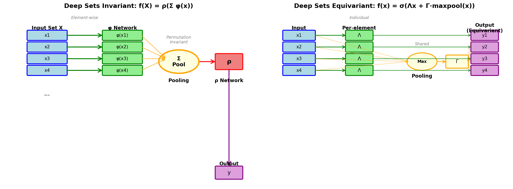

# Deep Sets

**A PyTorch implementation of permutation invariant and equivariant neural networks on sets.**

Deep Sets ([Zaheer et al., NeurIPS 2017](https://arxiv.org/abs/1703.06114)) is a universal architecture for learning functions on sets — collections of elements where order does not matter. This library provides a complete, tested implementation of every architectural variant described in the paper, with support for variable-size sets, multiple pooling strategies, and context conditioning.

```bibtex
@inproceedings{zaheer2017deep,
  title     = {Deep Sets},
  author    = {Zaheer, Manzil and Kottur, Satwik and Ravanbakhsh, Siamak and
               Poczos, Barnabas and Salakhutdinov, Russ R and Smola, Alexander J},
  booktitle = {Advances in Neural Information Processing Systems},
  pages     = {3391--3401},
  year      = {2017}
}
```

---

## Architecture Overview



The core idea: any permutation invariant function $f$ can be written as

$$f(\mathcal{X}) = \rho\!\left(\sum_{x \in \mathcal{X}} \varphi(x)\right)$$

where $\varphi$ transforms each element independently and $\rho$ processes the pooled result.

---

## Key Features

| Feature | Description |
|---------|-------------|
| **Invariant models** | `DeepSetsInvariant` — set → value mappings (classification, regression) |
| **Equivariant models** | `DeepSetsEquivariant` + `PermutationEquivariantLayer` — set → set mappings |
| **Conditional models** | `DeepSetsConditional` — context-conditioned set processing |
| **Variable-size sets** | First-class masking support across all model types |
| **Pooling options** | Sum, max, and mean pooling with correct mask handling |
| **Theoretical basis** | Implements Theorem 2 (invariance) and Lemma 3 (equivariance) exactly |

---

## Quick Links

**[Tutorials](tutorials/index.md)** — *Learning-oriented*
: New to Deep Sets? Start here for guided, hands-on introductions.
  [Getting Started](tutorials/getting-started.md) &nbsp;·&nbsp; [Training a Model](tutorials/training-a-model.md)

**[How-to Guides](how-to/index.md)** — *Task-oriented*
: Practical recipes for specific tasks.
  [Variable-Size Sets](how-to/variable-size-sets.md) &nbsp;·&nbsp; [Pooling Strategies](how-to/pooling-strategies.md) &nbsp;·&nbsp; [Equivariant Models](how-to/equivariant-models.md) &nbsp;·&nbsp; [Conditional Models](how-to/conditional-models.md)

**[Reference](reference/index.md)** — *Information-oriented*
: Complete API documentation for every class and function.
  [API Reference](reference/api.md)

**[Explanation](explanation/index.md)** — *Understanding-oriented*
: Theory, proofs, and design rationale.
  [Deep Sets Theory](explanation/theory.md) &nbsp;·&nbsp; [Architecture Decisions](explanation/architecture.md)
